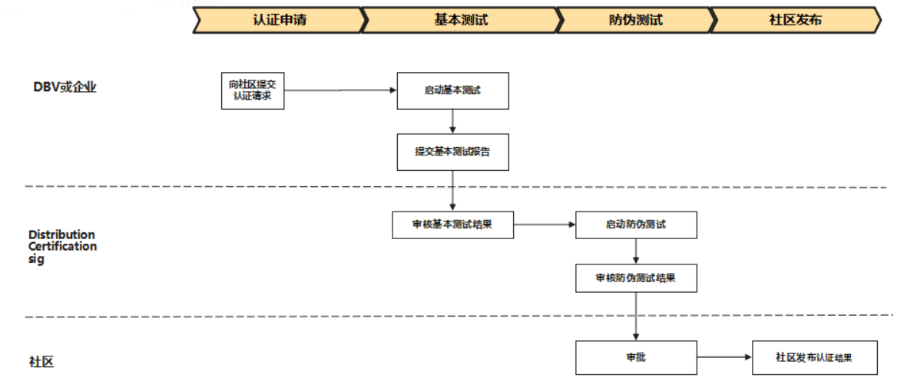

# distribution-certification

## 介绍
本仓库存放openGauss发行版认证（参考https://opengauss.org/zh/certification/ ）的文档及工具，包括：流程/用例/工具。

## 发行版认证认证概述
用于评估数据库发行版是否是基于openGauss，是否满足openGauss的技术生态。

## 发行版认证认证流程
openGauss兼容性技术测评标准确认和发布的流程如下：

- 步骤1. 向社区提交认证请求。在社区提交issue，并提供公司全称/发行版名称及版本号/对应openGauss的版本号/发行版下载链接
- 步骤2. 启动基本测试。基本测试包括基本功能，性能，稳定性等，详细要求参考docs/DBV 认证测试报告模板1.0.md
- 步骤3. 提交基本测试报告。在issue上上传测试报告。
- 步骤4. 审核基本测试报告结果。申请sig例会，在例会上评审基本测试报告内容。
- 步骤5. 社区启动防伪测试。伙伴需提一键安装脚本，对一键安装脚本要求如下：   
　　（1）shell/python脚本均可   
　　（2）脚本可进行下列参数设置：   
　　　　0. hostname -- 安装机器ip   
　　　　1. username -- 安装数据库的用户   
　　　　2. userpasswd -- 安装数据库的用户密码   
　　　　3. port -- 数据库端口号   
　　　　4. install_path -- 数据库安装目录（如/opt/huawei/install/app）   
　　　　5. dn_path -- 数据库实例目录（如/opt/huawei/install/data/dn）   
　　　　6. dbuser -- 创建好的可用于连接JDBC的数据库用户   
　　　　7. dbpasswd -- 创建好的可用于连接JDBC的数据库用户密码   
　　　　8. dbname -- 创建好的可用于连接JDBC的数据库   
　　（3）安装完成后，保证可以用openGauss社区jdbc驱动包连接到数据库。   
　　注意：未按上面要求提供脚本，将无法完成防伪测试。   
- 步骤6. 审核防伪测试结果。
- 步骤7. 审批。基本测试和防伪测试均通过后，将获得审批通过。
- 步骤8. 社区发布认证结果。

#### 参与贡献

1.  Fork 本仓库
2.  新建 Feat_xxx 分支
3.  提交代码
4.  新建 Pull Request

