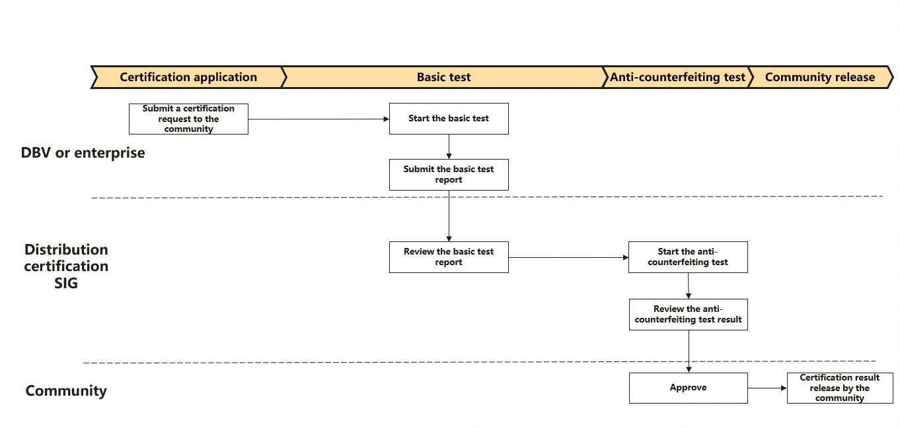

# distribution-certification

## Introduction

This repository stores the documents and tools for openGauss distribution certification (see <https://opengauss.org/en/certification/>), including the process, cases, and tools.

## Distribution Certification Overview

It is used to evaluate whether a database 
distribution is based on openGauss and whether it meets the openGauss technical ecosystem.

## Distribution Certification Process

The process for confirming and releasing the openGauss compatibility technical evaluation criteria is as follows:

- Step 1. Submit a certification request to the community. Submit an issue to the community and provide the full company name, distribution name and version number, corresponding openGauss version number, and distribution download link.
- Step 2. Start the basic test. It includes basic functions, performance, and stability. For details, see `docs/DBV Certification Test Report Template 1.0.md`.
- Step 3. Submit the basic test report. Upload the test report to the issue.
- Step 4. Review the basic test report. Apply for a SIG meeting and review the basic test report at the meeting.
- Step 5. The community starts the anti-counterfeiting test. Partners to provide the one-click installation script. The requirements for the one-click installation script are as follows:  
　　(1) Both shell and Python scripts are supported.  
　　(2) The following parameters can be set in the script:  
　　　　0. hostname -- Host IP address for installation  
　　　　1. username -- User who installs the database  
　　　　2. userpasswd -- Password of the user who installs the database  
　　　　3. port -- Database port number  
　　　　4. install_path -- Database installation directory (for example, `/opt/huawei/install/app`)  
　　　　5. dn_path -- database instance directory (for example, `/opt/huawei/install/data/dn`)  
　　　　6. dbuser -- Database user that can be used to connect to JDBC  
　　　　7. dbpasswd -- Password of the database user that can be used to connect to JDBC  
　　　　8. dbname -- Password of the database user that can be used to connect to JDBC  
　　(3) After the installation is complete, ensure that the openGauss community JDBC driver package can be used to connect to the database.  
　　Note: If the script is not provided as required, the anti-counterfeit test cannot be completed.  
- Step 6. Review the anti-counterfeiting test result.
- Step 7. Approve. The certification will be approved after both the basic test and anti-counterfeiting test are passed.
- Step 8. The community releases the certification result.

### Open-Source Contributions

1. Fork this repository.
2. Create a Feat_xxx branch.
3. Commit code.
4. Create a pull request (PR).
